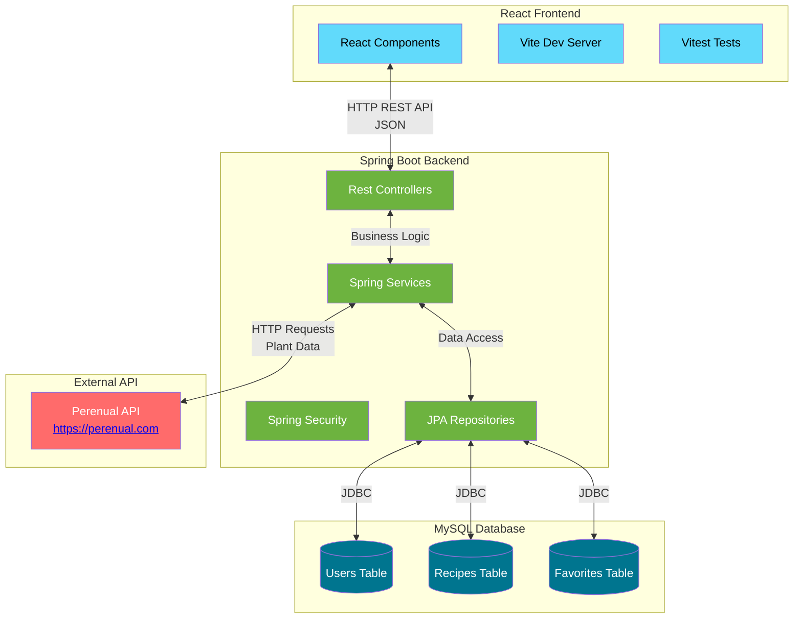

# 🚧 Herbarium

## 🤔 Overview

Herbarium will be a full-stack web application that allows users to explore a comprehensive database of medicinal plants, save their favorites in a personal dashboard, and create and manage their own herbal recipes and preparation methods.

## ✨ Features & Requirements

The objective of this final project will be to meet the following key requirements, which will serve as guiding principles for its development.

1. **User Authentication & Authorization:** Secure login/logout and user registration.
2. **Plant Exploration:** Search, filter, and browse plants from the [Pernual API](https://perenual.com/).
3. **Favorites Management:** Users can add/remove plants from their personal favorites list.
4. **Personal Herbarium (Dashboard):** A private area for users to view their favorites and manage their custom recipes.
5. **Recipe Management:** Create, Read, Update, and Delete (CRUD) personal herbal recipes associated with specific plants.

## ✍️ Technical Diagrams for Herbarium Application

### Types of diagrams

#### 1. Architecture Overview

* A simple diagram showing the overall structure and flow of the full-stack web application.
* It is divided into **React Frontend** <-> **Spring Boot Backend** <-> **MySQL Database**, with the Backend also calling the **External Perenual API**.

## ℹ️ About

This project is part of the [Full Stack Web Development training program](https://factoriaf5.org/aprende/desarrollo-web-full-stack-asturias/) in [Asturias](https://en.wikipedia.org/wiki/Asturias), offered by [Factoría F5](https://factoriaf5.org/).

The curriculum covers a wide range of topics, from basic programming languages ​​and UX principles to advanced project development techniques. It includes front-end and back-end technologies, agile methodologies, and tools for user experience design and database development. The program also focuses on essential soft skills such as communication, problem-solving, teamwork, adaptability, and time management.

## 📧 Contact

For any questions or inquiries, please do not hesitate to contact me!

Happy coding! 🌱 🐒
