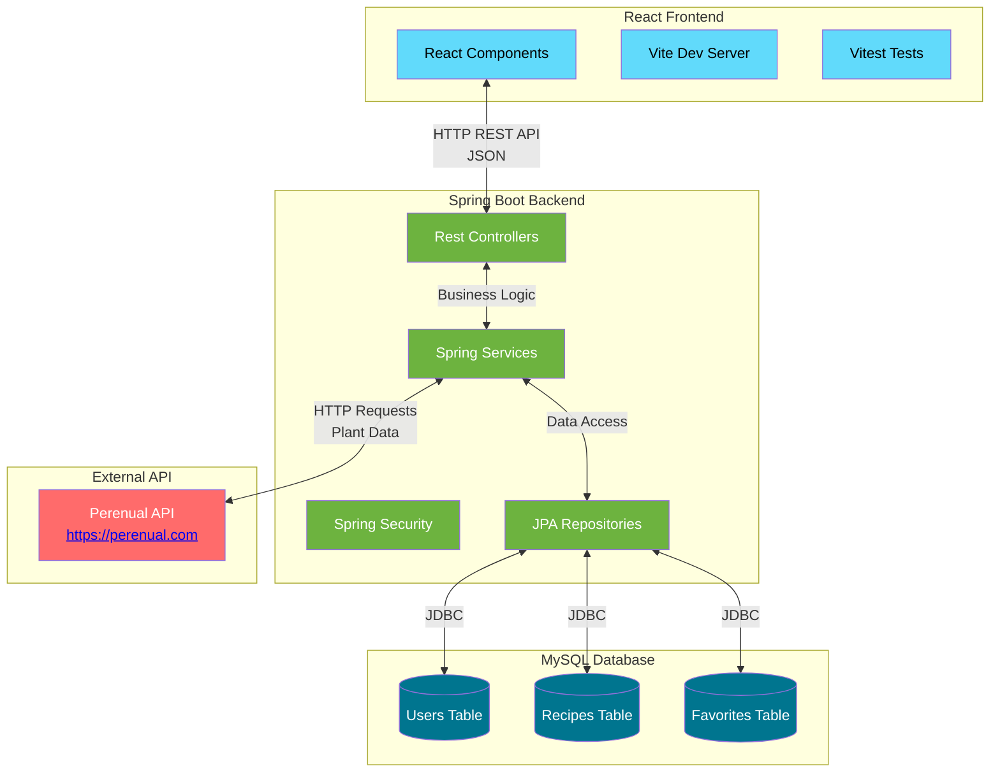

# ✍️ Technical Diagrams for Herbarium Application

## Types of diagrams

### ✅ 1. Architecture Overview

* A simple diagram showing the overall structure and flow of the full-stack web application.
* It is divided into **React Frontend** <-> **Spring Boot Backend** <-> **MySQL Database**, with the Backend also calling the **External Perenual API**.

### 2. Sitemap - The "Floor Plan"

* **What it is:** A map of all the pages in your application and how they connect.

* **What it does:** Shows the complete user journey - where users start, what pages they can visit, and how they navigate between them.

* **Why I need it:** Just like a house floor plan shows how rooms connect, this ensures my app has logical navigation. It helps me plan what pages to build and makes sure users can easily find what they need.

* **Simple analogy:** Think of it as the menu and table of contents for my website.

### 3. Chen Diagram - The "Relationship Map"

* **What it is:** A high-level diagram showing what types of data I have and how they relate to each other.

* **What it does:** Identifies my main data categories (Users, Recipes, Plants) and shows connections like "one user can create many recipes" or "many users can favorite many plants."

* **Why I need it:** It helps me understand the business logic before worrying about technical details. It answers questions like "Can one recipe belong to multiple users?"

* **Simple analogy:** It's like listing all the types of people in a company (managers, employees, customers) and showing who works with whom.

### 4. Crow's Feet Diagram - The "Database Blueprint"

* **What it is:** The technical specification for your database structure.

* **What it does:** Shows exactly what data I'll store (user email, recipe title, etc.), what type of data it is (text, number, date), and the precise relationships between tables.

* **Why I need it:** This is what I follow to build the actual database. It ensures data is stored efficiently and relationships work correctly.

* **Simple analogy:** If the Chen diagram says "we need bedrooms and bathrooms," the Crow's Feet diagram specifies "each bedroom must have exactly one door and at least one electrical outlet."

### 5. UML Class Diagram - The "Building Instructions"

* **What it is:** A detailed blueprint of all the code components and how they work together.

* **What it does:** Shows every major piece of my application - what data each part handles, what actions it can perform, and how different parts communicate.

* **Why I need it:** This is my development roadmap. It ensures all programmers understand what each component should do and how they should interact. It prevents confusion and duplicated work.

* **Simple analogy:** If building a car, this would show the engine, transmission, brakes - what each part does, what connections it needs, and how they all work together.

## Putting It All Together

Think of building your Herbarium app like constructing a house:

* **Architecture Overview** = A simple diagram showing the overall structure of the full-stack web application

* **Sitemap** = Room layout and flow

* **Chen Diagram** = Family needs (parents need office, kids need playroom)

* **Crow's Feet Diagram** = Electrical and plumbing blueprints

* **UML Diagram** = Construction instructions for each component

Each diagram serves a different purpose and audience, but together they provide a complete picture of what I am building, how it should work, and how to build it correctly.
